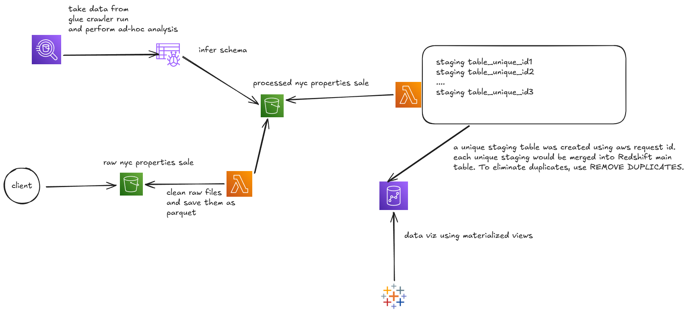
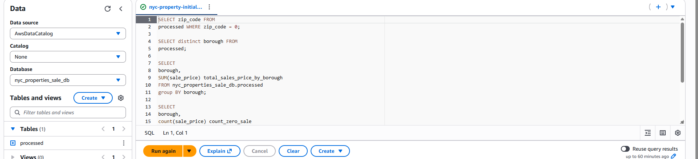

# NYC properties sales DE pipeline

## About
This project involves the design and implementation of an end-to-end AWS Serverless data engineering pipeline to ingest, transform, and analyze multiple years of New York City property sales data. By processing over two decades of records, the system provides a  view of the NYC properties market, enabling analysis of price-per-square-foot trends, borough-specific growth, and the long-term impact of economic cycles (2008 Financial Crisis, 2020 Pandemic) on the city's five boroughs.

## Tech stack
AWS Lambda, AWS Wranger, Pandas: Data Manipulation and Data Cleaning
 
AWS S3: Storage for raw .xls and .xlsx files and .parquet files used by Athena for ad-hoc analysis and Redshift for creating tables.
 
AWS Athena: Ad-hoc analysis. Make sure data is good before writing it into Redshift.
 
AWS Glue Crawler: Infer schema from processed folder to build database for Athena to use.
 
AWS Redshift: Warehouse that contains cleansed, sales data. 
 
Tableau: Data Visualization. Uses Data from Redshift. 

## Architecture

## Challenges that I ran into:
Challenge 1: Managed lambda function size. I tried to add too many dependencies to the layers. I later found AWS Wranger so I used that instead of the pandas library I added to the layer. Also lambda could not recognize modules in the layer so I ended up using --platform manylinux2014_x86_64 to make the modules compatible with the x86_64 architecture.
 

Challenge 2: I went with the default base RPU capacity of redshift but I found it a bit too expensive for my use case. I actually burned through 20 dollars within 2 days. So I scaled back to 4 RPUs and capped them at 8 RPUs. I found the cost went down from about 10 dollars/day to 1/day. I thought of using Glue jobs initially but my lambda functions finished transformation in reasonable amounts of time (cleaning and moving 10 of thousands records to various sources from excel files that had inconsistent column structure and execessive amount of header texts within seconds) so I ditched that idea. 
 

Challenge 3: Merged multiple parquet files into the final cleansed table. I used md5 to generate unique IDs using all columns to make sure each row was unique. For each staging, temporary table, I leveraged AWS unique request IDs to make sure everyime a client uploaded a file, a unique staging table for the file was created. I also used upsert and REMOVE DUPLICATES command from Redshift to make sure there would be no duplicates. This was a bit challenging to implement since I had to make sure there was no race condition when staging tables were merged into the final table. 